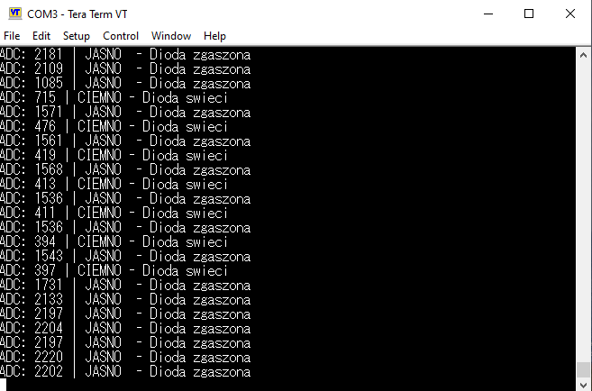

# STM32 Smart Lighting System 

An embedded C system designed for the **STM32F411RE (Nucleo-64)** platform. It automates an external LED's brightness based on ambient light levels, using hardware peripherals for high efficiency and real-time monitoring.

## 🛠 Technical Stack
* **Microcontroller:** ARM Cortex-M4 (STM32F411RE)
* **Framework:** STM32Cube HAL (Hardware Abstraction Layer)
* **Programming Language:** C (Embedded)
* **Key Peripherals:**
    * **ADC1 (12-bit):** Samples analog voltage from a photoresistor circuit (on PC0).
    * **TIM2 (PWM CH2):** Generates 100 Hz signal for flicker-free LED dimming (on PA1).
    * **UART2 (115200 bps):** Transmits telemetry data for debugging via standard USB.

## 🚀 Demonstration: How it works

### 1. LED Dimming in Action (GIF)

### 2. Live Telemetry from Serial Terminal (Tera Term)
This screenshot from Tera Term shows the underlying system logs. For every conversion cycle, the firmware transmits:
* **`ADC:`** Raw 12-bit value (0–4095).

## 🔌 Hardware Setup

The system uses a simple voltage divider circuit with a photoresistor (LDR) and a 10kΩ resistor. An external LED (with a 330Ω current-limiting resistor) is connected to pin **PA1**.

| Component | STM32 Pin | Note |
| :--- | :--- | :--- |
| **LDR (Photoresistor)** | **PC0 (ADC1_IN10)** | Voltage Divider circuit |
| **LED** | **PA1 (TIM2_CH2)** | PWM Output |
