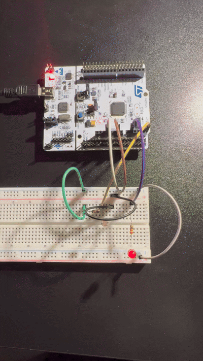

# STM32 Smart Lighting System 

An embedded C system designed for the **STM32F411RE (Nucleo-64)** platform. It automates an external LED's brightness based on ambient light levels, using hardware peripherals for high efficiency and real-time monitoring.

## 🛠 Technical Stack
* **Microcontroller:** ARM Cortex-M4 (STM32F411RE)
* **Framework:** STM32Cube HAL (Hardware Abstraction Layer)
* **Programming Language:** C (Embedded)
* **Key Peripherals:**
    * **ADC1 (12-bit):** Samples analog voltage from a photoresistor circuit (on PC0).
    * **TIM2 (PWM CH2):** Generates 100 Hz signal for flicker-free LED dimming (on PA1).
    * **UART2 (115200 bps):** Transmits telemetry data for debugging via standard USB.

## 🚀 Demonstration: How it works

### 1. LED Dimming in Action (GIF)
Here you can see the autonomous control in real-time. The system calculates discrete brightness levels (from 10% to 100%) by mapping the inverted photoresistor value. The transitions happen in precise, calibrated steps.

### 2. Live Telemetry from Serial Terminal (Tera Term)
This screenshot from Tera Term shows the underlying system logs. For every conversion cycle, the firmware transmits:
* **`ADC:`** Raw 12-bit value (0–4095).
* **`Jasnosc:`** Calculated duty cycle percentage (from 10% to 100%) which is then mapped to PWM output.

## 🔌 Hardware Setup

The system uses a simple voltage divider circuit with a photoresistor (LDR) and a 10kΩ resistor. An external LED (with a 330Ω current-limiting resistor) is connected to pin **PA1**.

| Component | STM32 Pin | Note |
| :--- | :--- | :--- |
| **LDR (Photoresistor)** | **PC0 (ADC1_IN10)** | Voltage Divider circuit |
| **LED** | **PA1 (TIM2_CH2)** | PWM Output |

## 🏗 Key Engineering Concepts

### Discrete Step Quantization
Instead of smooth dimming, this system implements discrete step logic to simulate a "gearbox" effect for the LED brightness. This makes changes more pronounced and easier to observe, while maintaining efficient control.

### Clamping & Input Safety
Robust checking is implemented to prevent the PWM duty cycle from exceeding Timer limits (0%–100%). Any raw ADC value outside of the calibrated range is safely clamped to the minimum or maximum allowed value.
